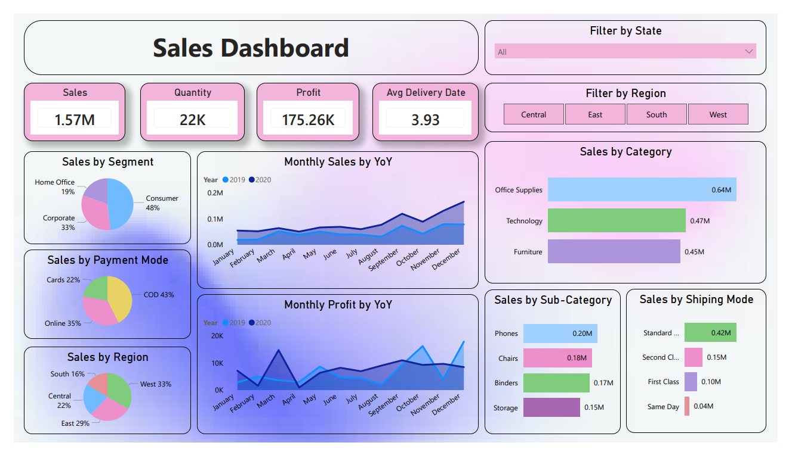
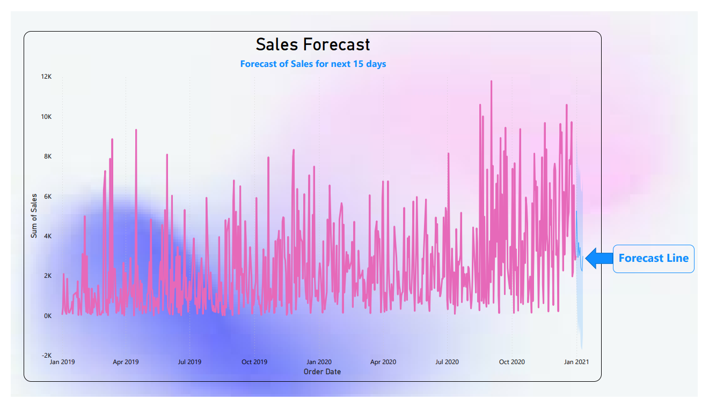
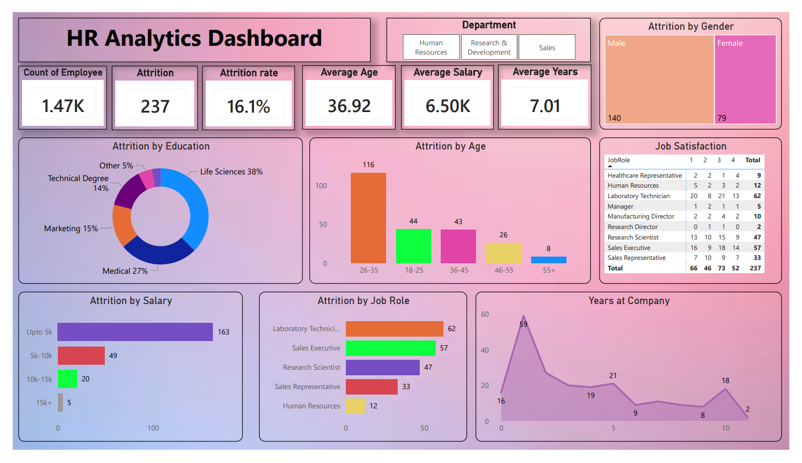
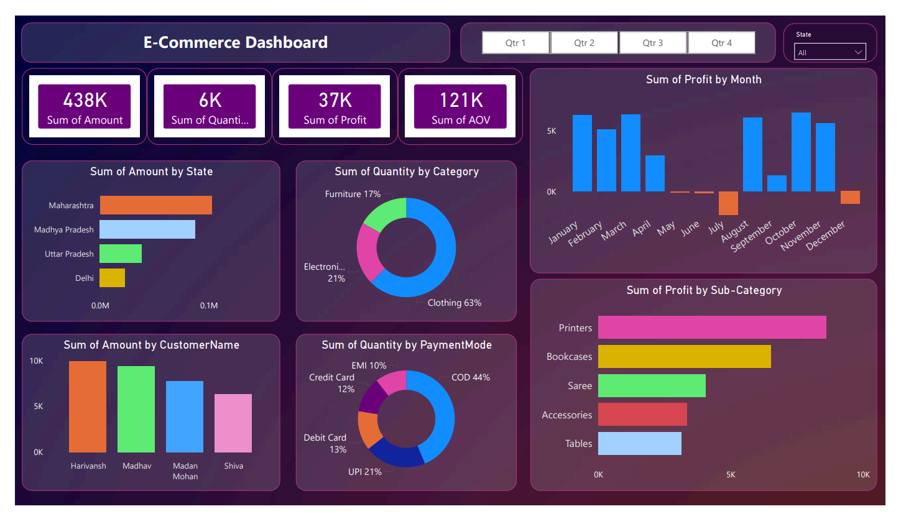

# 📊 Business Analytics Portfolio

Welcome to my Business Analytics Portfolio. This repository showcases Power BI projects focused on business intelligence, data analytics, KPI reporting, forecasting, and data-driven decision-making.

## About Me

I am passionate about transforming raw data into actionable business insights through data analysis, visualization, and reporting.

### Skills Demonstrated

* Power BI
* Power Query
* DAX
* Microsoft Excel
* Data Cleaning
* Data Transformation
* Data Modeling
* Dashboard Development
* KPI Reporting
* Business Analytics
* Data Visualization
* Forecasting

---

# Projects

## 📈 Sales Analytics Dashboard

### Project Overview

Developed an interactive Sales Analytics Dashboard to analyze revenue, profitability, customer segments, regional performance, shipping methods, and sales trends.

### Dashboard Preview

### Key Features

* Sales Performance Analysis
* Profitability Analysis
* Regional Analysis
* Category & Sub-Category Analysis
* Shipping Mode Analysis
* Payment Mode Analysis
* Year-over-Year Sales Trends
* Sales Forecasting

### Technologies Used

* Power BI
* Power Query
* Microsoft Excel
* DAX

### View Project

➡️ [Open Sales Analytics Dashboard](./Sales-Analytics-Dashboard/README.md)

---

## 👥 HR Analytics Dashboard

### Project Overview

Built an HR Analytics Dashboard to identify workforce trends, employee attrition patterns, and employee satisfaction metrics.

### Dashboard Preview

### Key Features

* Attrition Analysis
* Employee Demographics
* Salary Analysis
* Job Satisfaction Analysis
* Department-Level Insights
* Workforce Retention Metrics

### Technologies Used

* Power BI
* Power Query
* Microsoft Excel
* DAX

### View Project

➡️ [Open HR Analytics Dashboard](./HR-Analytics-Dashboard/README.md)

---

## 🛒 E-Commerce Dashboard

### Project Overview

Designed an E-Commerce Dashboard to analyze customer purchasing behavior, profitability, sales performance, and payment trends.

### Dashboard Preview

### Key Features

* Customer Analysis
* Profit Analysis
* Sales Monitoring
* Product Category Analysis
* Payment Mode Analysis
* State-Wise Sales Analysis
* Monthly Profit Trends

### Technologies Used

* Power BI
* Power Query
* Microsoft Excel
* DAX

### View Project

➡️ [Open E-Commerce Dashboard](./E-Commerce-Dashboard/README.md)

---

